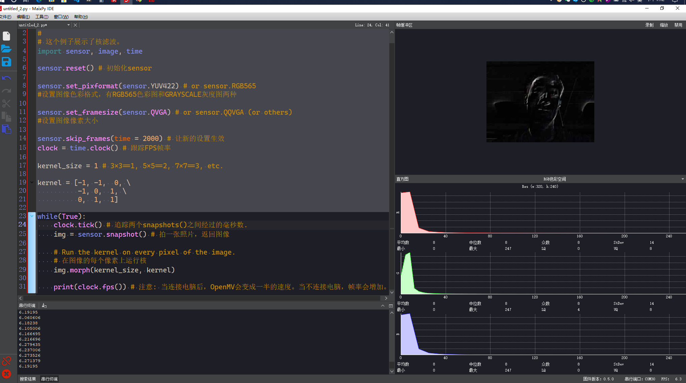

# 核滤波




例程

```python
# 核滤波
#
# 这个例子展示了核滤波。
import sensor, image, time

sensor.reset() # 初始化sensor

sensor.set_pixformat(sensor.GRAYSCALE) # or sensor.RGB565
#设置图像色彩格式，有RGB565色彩图和GRAYSCALE灰度图两种

sensor.set_framesize(sensor.QVGA) # or sensor.QQVGA (or others)
#设置图像像素大小

sensor.skip_frames(time = 2000) # 让新的设置生效
clock = time.clock() # 跟踪FPS帧率

kernel_size = 1 # 3x3==1, 5x5==2, 7x7==3, etc.

kernel = [-2, -1,  0, \
          -1,  1,  1, \
           0,  1,  2]

while(True):
    clock.tick() # 追踪两个snapshots()之间经过的毫秒数.
    img = sensor.snapshot() # 拍一张照片，返回图像

    # Run the kernel on every pixel of the image.
    # 在图像的每个像素上运行核
    img.morph(kernel_size, kernel)

    print(clock.fps()) # 注意: 当连接电脑后，OpenMV会变成一半的速度。当不连接电脑，帧率会增加。
```
